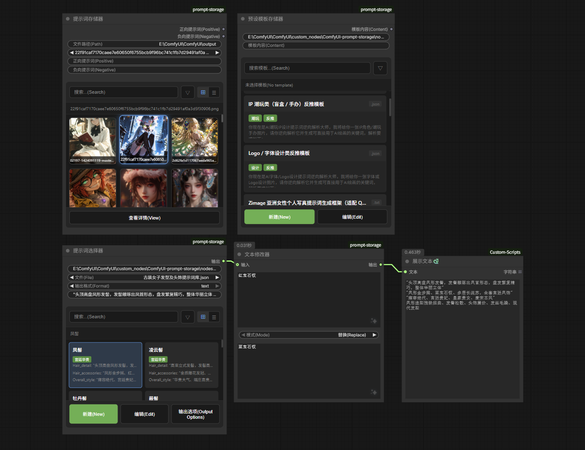

# ComfyUI-prompt-storage

A ComfyUI plugin for managing and storing prompt information for images.

**[📃中文版](./README_CN.md)**

## Project Introduction

ComfyUI-prompt-storage is a specialized ComfyUI plugin designed to manage and store prompt information for images. It allows users to load image files from the output directory, view their prompt details, and output prompt information for use in other nodes.

### Core Advantages
- **Simple and intuitive**: Easy to use with a clear interface, supports Chinese/English bilingual display
- **Image file support**: Loads images from the output directory, supports multiple formats
- **Prompt management**: Displays and manages prompt information for image files, supports positive/negative prompt multi-select
- **Tag system**: Supports adding tags to images for easy categorization and filtering
- **Preset templates**: Supports saving and managing prompt templates for quick reuse
- **Seamless integration**: Outputs prompts for use in other ComfyUI nodes
- **Visual interface**: Provides visual preview of image files, supports card view and list view

## Core Features

### Image Prompt Storage Node
- **Image file loading**: Loads image files from the output directory
- **Prompt display**: Shows positive and negative prompts associated with image files
- **Prompt selection**: Supports multi-select for positive prompts, single-select for negative prompts
- **Visual preview**: Displays thumbnails of image files, supports left/right navigation
- **Hover preview**: Shows detailed information preview on mouse hover
- **Edit functionality**: Supports editing filename, tags, style, prompts and other information
- **Tag filtering**: Filter images by tags
- **Tag note**: Multiple tags should be separated by English comma `,`, e.g., `portrait,realistic,landscape` (do not use Chinese comma `，`)

### Prompt Template Node
- **Template management**: Save, edit, and delete prompt templates
- **Template categorization**: Manage templates by style categories
- **Quick apply**: One-click apply templates to workflow
- **Search function**: Quick search for templates
- **File formats**: Supports reading TXT, JSON, MD format template files

### Prompt Selector Node
- **JSON file loading**: Loads and manages JSON format prompt files
- **Category management**: Organize prompt templates by categories, filter and create by category
- **New file creation**: Create new JSON format prompt files
- **Edit/Delete**: Edit and delete prompt templates
- **Output formats**: Supports multiple output formats (Text/JSON)
- **Custom output fields**: Customize output field selection

#### Preview Image

## Installation Instructions

### 1. Basic Installation

1. **Clone or download the plugin**:
   - Place the plugin folder into `ComfyUI/custom_nodes/` directory
   - The folder name should be `ComfyUI-prompt-storage`

2. **Install dependencies**:
   - The plugin has no additional dependencies beyond ComfyUI's default requirements

### 2. Usage

1. **Add the node to your workflow**:
   - In ComfyUI, add the desired node from the "prompt" category:
     - "Image Prompt Storage" - for managing image prompts (cache directory: `ComfyUI/custom_nodes/ComfyUI-prompt-storage/cache/` and `data/`)
     - "Prompt Template" - for managing prompt templates (cache directory: `ComfyUI/custom_nodes/ComfyUI-prompt-storage/templates/`)
     - "Prompt Selector" - for loading and managing JSON format prompt files (cache directory: `ComfyUI/custom_nodes/ComfyUI-prompt-storage/prompt/`)

2. **Configure Image Prompt Storage Node**:
   - Cache directory: `ComfyUI/custom_nodes/ComfyUI-prompt-storage/cache/` and `data/`
   - Set the file path to the output directory
   - Select an image file from the dropdown list
   - Click the "View" button to open the visual interface

3. **Configure Prompt Template Node**:
   - Default cache directory: `ComfyUI/custom_nodes/ComfyUI-prompt-storage/templates/`
   - Supports TXT, JSON, MD format template files
   - Click the "Manage Templates" button to open the template management interface
   - Create, edit, or delete templates

4. **Configure Prompt Selector Node**:
   - Default cache directory: `ComfyUI/custom_nodes/ComfyUI-prompt-storage/prompt/`
   - Only supports JSON format prompt files
   - Select a JSON format prompt file from the dropdown list
   - Select output format (Text or JSON)
   - Click "New" button to create new card or new file
   - Click "Edit" button to edit selected card
   - Click "Output Options" to customize output fields

5. **Use the output**:
   - The node outputs prompt content
   - Connect the output to other nodes that require prompt inputs

## Workflow Examples

### Basic Usage

1. Add the "Image Prompt Storage" node to your workflow
2. Select an image file from the dropdown list
3. Click the "View" button to open the visual interface
4. Select the desired positive/negative prompts in the interface
5. Connect the outputs to other nodes
6. Execute the workflow to use the prompts

### Using Preset Templates

1. Add the "Prompt Template" node to your workflow
2. Click "Manage Templates" to create or select a template
3. Connect the template output to other nodes
4. Execute the workflow

### Using Prompt Selector

1. Add the "Prompt Selector" node to your workflow
2. Select a JSON prompt file from the file dropdown list
3. Click "New" button to create new prompt card or new file
4. Fill in title, category, and content in the popup dialog
5. Select category or enter new category name
6. Click "Save" to complete creation
7. Select the desired prompt in the card list
8. Connect the output to other nodes
9. Execute the workflow

## Changelog

#### v1.2.0
- Added Prompt Selector node, supports loading and managing JSON format prompt files
- Supports organizing prompt templates by categories, filter and create by category
- Added new file creation function, supports creating new JSON format prompt files
- Supports editing and deleting prompt templates
- Supports multiple output formats (Text/JSON)
- Supports custom output field selection
- Fixed card deletion function issue
- Fixed new card category saving issue

#### v1.1.0
- Added Prompt Template node, supports saving and managing prompt templates
- Supports organizing templates by categories, quick search and apply
- Supports reading TXT, JSON, MD format template files
- Added card view and list view switching
- Added mouse hover preview functionality
- Optimized interface display, supports Chinese/English bilingual
- Optimized visual interface layout
- Optimized button styles, unified green confirm button
- Fixed various known issues

#### v1.0.0
- Initial release of Image Prompt Storage node
- Supports loading image files from output directory
- Displays positive and negative prompts associated with image files
- Supports multi-select for positive prompts, single-select for negative prompts
- Provides visual preview interface for image files

## Acknowledgments
- [ComfyUI](https://github.com/comfyanonymous/ComfyUI) @comfyanonymous
